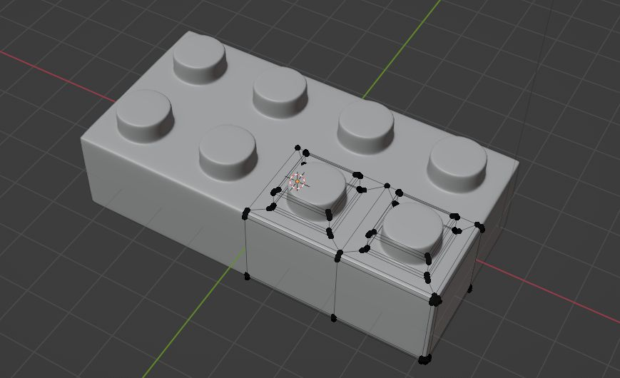

Juni 2022: **My ([uwsd](https://www.linkedin.com/in/uwe-wlaschny-1a949a19a/)) works on:**

> ## Creating Modular Environments
- by **[Rob Tuytel](https://www.udemy.com/course/creating-modular-environments/#instructor-1)**, [Udemy Course](https://www.udemy.com/course/creating-modular-environments/)

Asset Credits:

Annotations: 

Rating: 

2.4 Brick Piece 
