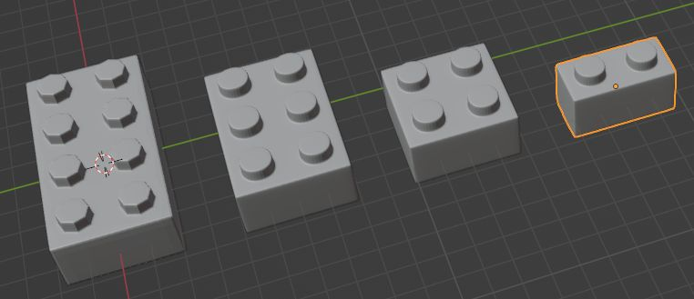
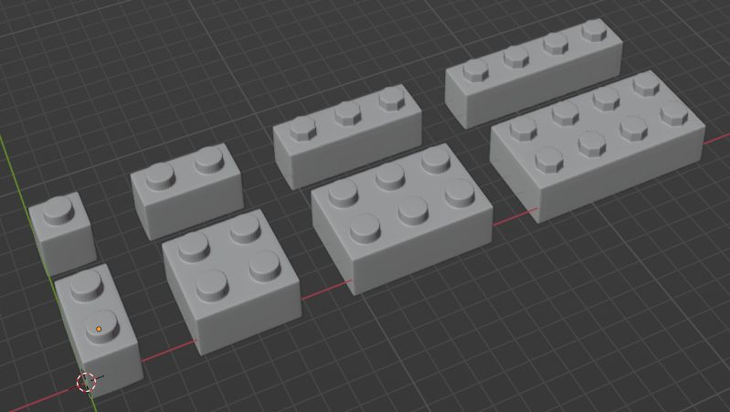
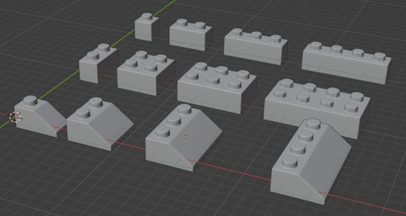
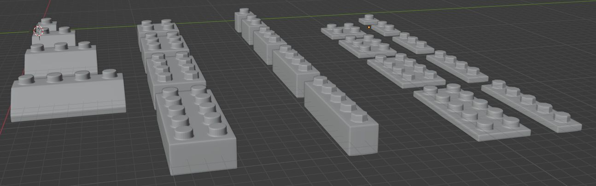
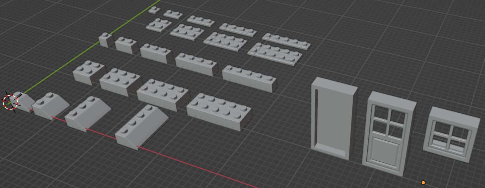

Juni 2022: **My ([uwsd](https://www.linkedin.com/in/uwe-wlaschny-1a949a19a/)) works on:**

> ## Creating Modular Environments
- by **[Rob Tuytel](https://www.udemy.com/course/creating-modular-environments/#instructor-1)**, [Udemy Course](https://www.udemy.com/course/creating-modular-environments/)

Asset Credits:

Annotations: 

Rating: 

| 2.4 Brick Piece | 2.5 Brick (of 1, 2, 3, 4)| 2.6 Brick Pieces (all variants) | 2.7 Brick Pieces (added skews) |
|---|---|---|---|
|  | |  |  |
| 2.8 Brick Pieces (added flats) | 2.9 Door and window | | |
|  |  | | |