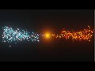

Juni 2019: **My ([uwsd](https://www.linkedin.com/in/uwe-wlaschny-1a949a19a/)) works on:**

> ## Blender Particles Tutorial
- by DCP Web Designers, [Youtube Video Tutorials](https://www.youtube.com/c/dcpwebdesigners)

---

Three years ago I started with some blender tutorials. This were my first trials with blender. Absolut suitable for beginning with the blender Particle System.

Blend files of my solutions:

* from [Blender Particles Tutorial - Blender 2.8 Beginners Tutorial](https://www.youtube.com/watch?v=5kfy3wxicMw) by DCP Web Designers 
**My rating**: 10/10 - Top Tutorial. Absolut suitable for beginning with the blender 2.8 Particle System

---

* from [Blender Particles Tutorial - Blender 2.8 Eevee](https://www.youtube.com/watch?v=WjA_mRwKu8c) by DCP Web Designers 
**My rating**: 10/10 - Top Tutorial. Absolut suitable for beginning with the blender 2.8 Particle System

---
